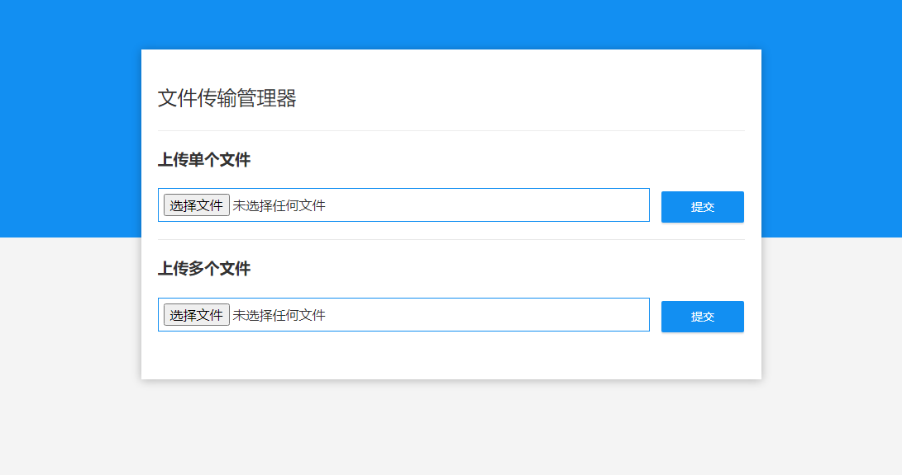

<div align="center">

# 文件传输管理器

<p align="center">
  <a href="https://github.com/chzhengx/file-transfer-manager/blob/b81662a68f922151edda4e7466493500be93747c/LICENSE">
    
  </a>
</p>

文件传输管理器是一个基于Spring Boot的应用，支持单文件或多文件的上传和下载。该应用提供了简洁的界面，用户可以轻松地将文件上传到指定目录并下载。

</div>



<a href="#readme">
    
</a>

## 💡 功能

- [x] 文件上传：支持单文件和多文件上传，文件将保存到配置的目录。
- [x] 文件下载：用户可以下载之前上传的文件。

<a href="#readme">
    
</a>

## 👨‍💻 配置和运行

**1. 克隆仓库：** 

```bash
git clone https://github.com/chzhengx/file-transfer-manager.git
```

**2. 配置上传目录：**

编辑 `src/main/resources/application.properties` 文件，设置 `file.upload-dir` 为你想要的上传路径。

```properties
file.upload-dir=/path/to/uploads
```

**3. 运行应用：**

```bash
cd file-transfer-manager
mvn spring-boot:run
```

访问 `http://localhost:8080` 查看应用。

<a href="#readme">
    
</a>

## 🌟 打包

生成 JAR 文件，然后运行：

```bash
mvn clean package
java -jar target/file-transfer-manager-0.0.1-SNAPSHOT.jar
```
<a href="#readme">
    
</a>

## 🏘️ 许可

本项目采用  许可。

<a href="#readme">
    
</a>
