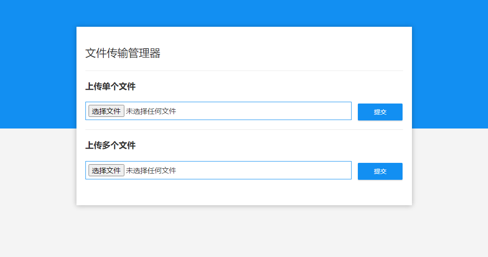

## 文件传输管理器



## 设置步骤

**1. 克隆仓库** 

```bash
git clone https://github.com/chzhengx/file-transfer-manager.git
```

**2. 指定文件上传目录**

打开 `src/main/resources/application.properties` 文件，并将属性 `file.upload-dir` 更改为你希望存储上传文件的路径。

```
file.upload-dir=/Users/chzhengx/uploads
```

**2. 使用 Maven 运行应用程序**

```bash
cd file-transfer-manager
mvn spring-boot:run
```

通过 `http://localhost:8080` 访问应用程序。

你也可以将应用程序打包成一个 jar 文件，然后像这样运行 jar 文件 -

```bash
mvn clean package
java -jar target/file-transfer-manager-0.0.1-SNAPSHOT.jar
```